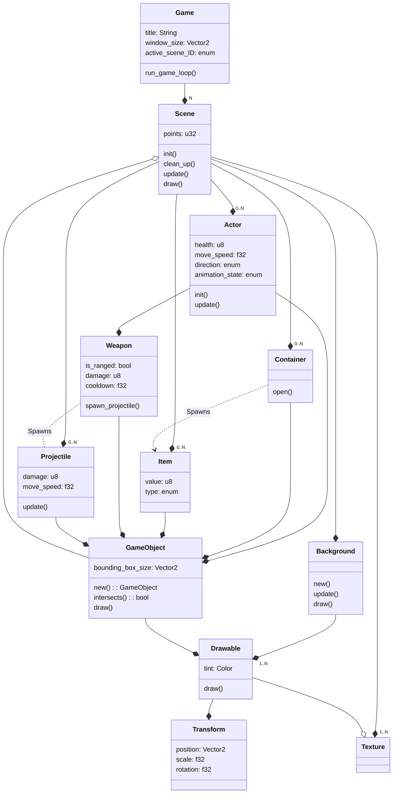

```mermaid
classDiagram

class Game{
    run_game_loop()
    title: String
    window_size: Vector2
    active_scene_ID: enum
}

class Scene{
    init()
    clean_up()
    update()
    draw()
    points: u32
}

class Actor{
    init()
    update()
    health: u8
    move_speed: f32
    direction: enum
    animation_state: enum
}

class Item{
    value: u8
    type: enum
}

class Background{
    new()
    update()
    draw()
}

class Drawable{
    draw()
    tint: Color
}

class Transform{
    position: Vector2
    scale: f32
    rotation: f32
}

class Weapon{
    is_ranged: bool
    damage: u8
    cooldown: f32
    spawn_projectile()
}

class Projectile{
    update()
    damage: u8
    move_speed: f32
}

class GameObject{
    new(): GameObject
    intersects(): bool
    draw()
    bounding_box_size: Vector2
}

class Container{
    open()
}

Game --* "N" Scene

Scene --* Background
Scene --* "0..N" Actor
Scene --* "0..N" Container
Scene --* "0..N" Item
Scene --* "0..N" Projectile
Scene --* "1..N" Texture

Container ..> Item: Spawns

Background --* "1..N" Drawable

GameObject --* Drawable
GameObject --o Scene

Actor --* GameObject
Container --* GameObject
Item --* GameObject
Weapon --* GameObject
Projectile --* GameObject

Drawable --* Transform

Drawable --o Texture

Actor --* Weapon

Weapon .. Projectile: Spawns
```